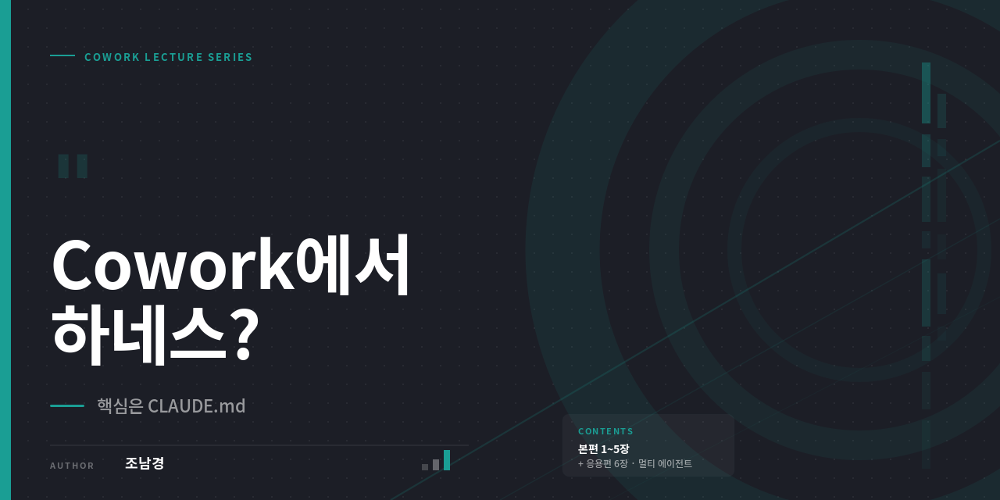

# Cowork에서 하네스? — 핵심은 CLAUDE.md



> Cowork 중급자를 위한 하네스 엔지니어링 교육 자료
> 작성: 조남경 (Blue) · 2026년 5월

---

## 이 자료는 무엇인가요

Claude Cowork에서 **CLAUDE.md를 중심으로 한 하네스(Harness)를 어떻게 설계하면 좋은지** 정리한 A4 인쇄용 교육 자료입니다. 개념부터 저자의 실전 설계 사례, 그리고 멀티 에이전트 응용까지 — 총 6장 34페이지로 구성되어 있습니다.

대상은 Cowork를 한두 번 써본 중급자입니다. "프롬프트만으로는 한계가 있다", "CLAUDE.md를 직접 쓰려니까 막막하다", "Skills를 어떻게 조합해야 할지 모르겠다" 같은 막힘을 풀어주는 데 초점을 맞췄습니다.

---

## 구성

자료는 **본편(1~5장)** 과 **응용편(6장)** 으로 나뉩니다.

**본편** 은 누구나 자기 작업에 바로 적용할 수 있는 하네스 설계 가이드입니다. 1장에서 하네스가 무엇인지 짚고, 2장에서 Cowork 안에서 어떤 레이어를 우리가 직접 설계할 수 있는지 살펴봅니다. 3장은 CLAUDE.md를 인터뷰 방식으로 만드는 법, 4장은 Skills를 전문가 에이전트로 활용하는 법, 5장은 저자가 실제로 운영 중인 설계를 공개합니다.

**응용편** 은 멀티 에이전트 사례입니다. `novel-writer-by-blue` 스킬을 가지고 Story Arc → Episode Writer × N → Flow/Fact Checker → 최종 취합으로 이어지는 Staged Parallel 구조를 설계한 과정을 담았습니다. 본편의 개념을 실제 멀티 에이전트 하네스로 확장한 응용 사례로 보시면 됩니다.

---

## 본편 (1~5장)

| 장 | 제목 | 페이지 |
|----|------|--------|
| 1장 | 개발자 얘기인 줄 알았던 하네스 | cover + 4p |
| 2장 | Cowork에서 하네스 쓰기 | cover + 4p |
| 3장 | CLAUDE.md, 직접 쓰지 마세요 | cover + 4p |
| 4장 | Skills — 전문가 에이전트 고용하기 | cover + 5p |
| 5장 | 저자의 실전 설계 | cover + 5p |

**다운로드**
- [📄 본편 PDF (28페이지)](./pdf/Cowork-하네스-기본편_1-5장.pdf)
- HTML 원본: [`html/`](./html/) 폴더의 1~5장 파일

---

## 응용편 (6장)

| 장 | 제목 | 페이지 |
|----|------|--------|
| 6장 | 멀티 에이전트 — 혼자 쓰는 소설, 다섯이 쓴다 | cover + 5p |

`novel-writer-by-blue` 스킬을 실제로 어떻게 설계했는지, `SKILL.md`와 `harness.md`를 분리해서 "하네스가 눈에 보이는 파일"을 어떻게 만들었는지 다룹니다. 멀티 에이전트가 필요한 순간과 단일 에이전트가 더 나은 순간을 구분하는 기준도 함께 정리되어 있습니다.

**다운로드**
- [📄 응용편 PDF (6페이지)](./pdf/Cowork-하네스-응용편_6장.pdf)
- HTML 원본: [`html/6장_멀티에이전트_혼자쓰는소설다섯이쓴다.html`](./html/6장_멀티에이전트_혼자쓰는소설다섯이쓴다.html)
- 스킬 패키지: [`skill/novel-writer-by-blue.skill`](./skill/novel-writer-by-blue.skill) — Cowork에 설치 가능

---

## 전체 합본

- [📄 전체 합본 PDF (34페이지)](./pdf/Cowork-하네스-전체_1-6장.pdf)

본편과 응용편을 한 권으로 묶은 버전입니다.

---

## 폴더 구조

```
.
├── README.md
├── thumbnail.png
├── pdf/
│   ├── Cowork-하네스-기본편_1-5장.pdf      (28p)
│   ├── Cowork-하네스-응용편_6장.pdf        (6p)
│   └── Cowork-하네스-전체_1-6장.pdf        (34p)
├── html/
│   ├── 1장_개발자 얘기인 줄 알았던 하네스.html
│   ├── 2장_Cowork에서하네스쓰기.html
│   ├── 3장_CLAUDE.md직접쓰지마세요.html
│   ├── 4장_Skills전문가에이전트고용하기.html
│   ├── 5장_저자의실전설계.html
│   └── 6장_멀티에이전트_혼자쓰는소설다섯이쓴다.html
└── skill/
    └── novel-writer-by-blue.skill
```

---

## 저자

**조남경** (Blue) — AI 입문 자료를 쓰는 사람

- 미드저니 코리아 페이스북 그룹 운영
- 클로드 코리아 페이스북 그룹 운영
- 카카오톡 오픈채팅 **Midjourney Korea** 운영
- 유튜브 [미드저니 코리아 조남경](https://www.youtube.com/@mjKorea123) 
- 저서: 미드저니 마스터 바이블, 클로드 디자인 시작하기 외 다수

---

## 라이선스

이 자료는 학습·공유 목적으로 자유롭게 사용할 수 있습니다. 원본 출처를 표기해주시면 감사하겠습니다.
